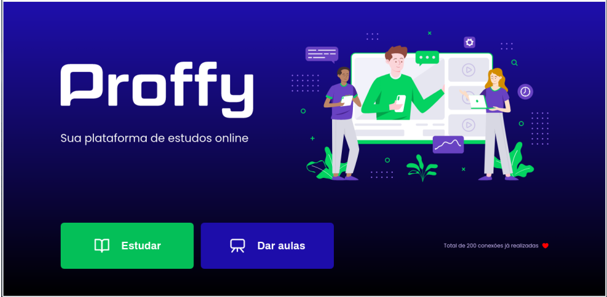

<p align="center"> 

</p>



# Proffy </span> - Next Level Week #2


_Aplicativo desenvolvido para conectar pessoas interessadas em estudar, com pessoas interessadas em dar aulas ._

_Capaz de registrar professores e o interessado filtrar, materia, horas, dias e professores disponíveis._


# Iniciar 🚀

_Estas instruções te permitirão obter uma copia do projeto em funcionamento em sua máquina local para propósitos de desenvolvimento e provas._

## Pré-requisitos 📋


### Clonar o repositório
git clone https://github.com/allyneromanosque/proffy-nlw


## Instalação através do terminal 🔧
``` bash
#Navegar até o diretório 
cd proffy-nlw

#Baixar as dependências com o comando 
npm i

#Executar o servidor 
npm run dev
```
A seguir abra o seu navegador e acesse http://localhost:5500/


## Tecnologias utilizadas 🛠️

- JavaScript
- HTML
- CSS
- Node.js
- Express
- SQLite
- Nunjucks

## Licença 📄

Este projeto está sob a linceça MIT. - veja o aquivo [license txt](license.txt) para detalhes

## Gratidão 🎁

* **Rocketseat** - *Plataforma de Educação e Tecnologia* - [Roketseat](https://github.com/rocketseat)
* **Mayk Brito** - *Instrutor* - [Mayk Brito](https://github.com/maykbrito)

* **Tiago Luchtenberg** - *Desenhador da Interface* - [Tiago Luchtenberg](https://www.instagram.com/tiagoluchtenberg/)


---
⌨️ con ❤️ por [Allyne Romanosque](https://www.linkedin.com/in/allyneromanosque/) 😊